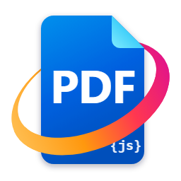

# SmartPDF

A lightweight PDF viewer for Windows, built on Mozilla's [PDF.js](https://github.com/mozilla/pdf.js) and running in WebView2.
Highlight text, add free text, drawings, images and signatures – annotations are saved into the PDF as standard annotations and
show up in other viewers as well. Everything runs locally: no uploads, no telemetry.

**The user interface is German only.**

## Highlights

- Open files with Ctrl+O, by drag & drop or from the command line: `SmartPDF.exe file.pdf`
- Save with Ctrl+S; SmartPDF asks before closing or switching files with unsaved changes
- Extra shortcuts: Ctrl+H highlight, Ctrl+T text, Ctrl+G go to page, Ctrl+I document properties, F11 full-screen presentation
- F1 or the “?” button opens the help (`SmartPDF-Hilfe.pdf`, German) with all keyboard shortcuts

## Requirements

Windows 10/11 (x64), [.NET 10 Desktop Runtime](https://dotnet.microsoft.com/download/dotnet/10.0) and the
[Microsoft Edge WebView2 Runtime](https://developer.microsoft.com/microsoft-edge/webview2/) (preinstalled on Windows 11).

## Building

1. Download `pdfjs-<version>-dist.zip` (not the “legacy” build) from the [PDF.js releases](https://github.com/mozilla/pdf.js/releases)
   and extract it into a folder `pdfjs\` next to `SmartPDF.csproj`.
2. `dotnet build SmartPDF.csproj -c Release -p:Platform=x64`
3. Optional installer: compile `Installer.iss` with [Inno Setup](https://jrsoftware.org/isinfo.php) 7.

## License

SmartPDF is licensed under the Apache License 2.0 (see `LICENSE`). PDF.js is © Mozilla and the PDF.js contributors, also under the
Apache License 2.0. SmartPDF is not a Mozilla product; “Mozilla” is a trademark of the Mozilla Foundation.
